# Awesome-IDEs

Welcome to **Awesome-IDEs**, a curated list of Integrated Development Environments (IDEs) and intelligent code editors. This list aims to help you discover the perfect environment for your workflow, whether you need a lightweight editor, a robust integrated environment, or a next-generation AI-powered assistant.

## Table of Contents

- [Introduction](#introduction)
- [AI-Powered & Next-Gen IDEs](#ai-powered--next-gen-ides)
- [General Purpose IDEs](#general-purpose-ides)
- [Language-Specific IDEs](#language-specific-ides)
    - [Python](#python)
    - [Java](#java)
    - [C/C++](#cc)
    - [PHP](#php)
    - [Go](#go)
    - [Rust](#rust)
    - [Ruby](#ruby)
- [Web Development](#web-development)
- [Mobile Development](#mobile-development)
- [Data Science](#data-science)
- [Game Development](#game-development)
- [Embedded Systems](#embedded-systems)
- [Version Control & Tools](#version-control--tools)
- [Contributing](#contributing)
- [License](#license)

## Introduction

Choosing the right IDE can significantly impact your productivity. The landscape is evolving rapidly, with a new wave of **AI-First IDEs** changing how we write code. This list categorizes structured environments by their primary focus, while using **Tags** to highlight cross-capabilities (like Web support in a Java IDE or AI integration).

**Key to Tags:**
- `AI-Native`: Built from the ground up for AI.
- `AI-Ready`: Has strong, official AI plugins or integrations.
- `Lightweight`: Fast startup, low resource usage.
- `Polyglot`: Excellent support for many languages.

## AI-Powered & Next-Gen IDEs

These IDEs are built with Artificial Intelligence at their core or represent the next generation of high-performance editors.

| Name | Description | Links | System Support | Fees | Tags |
| :--- | :--- | :--- | :--- | :--- | :--- |
|  **Cursor** | An AI-first code editor built on top of VS Code. It understands your entire codebase and allows for natural language coding and diff revisions. | [Website](https://cursor.com/) | `Mac` `Windows` `Linux` | Freemium, Proprietary | `AI-Native` `Fork-of-VSCode` |
|  **Windsurf** | The first "agentic" IDE by Codeium. It features "Flow" to keep context of your work and can act autonomously to refactor or generate code. | [Website](https://codeium.com/windsurf) | `Mac` `Windows` `Linux` | Freemium, Proprietary | `AI-Native` `Agentic` |
|  **Zed** | A high-performance, multiplayer code editor written in Rust. Designed for speed and collaboration with built-in AI chat. | [Website](https://zed.dev/)   [Github](https://github.com/zed-industries/zed) | `Mac` `Linux` `Windows (Preview)` | Free, Open-Source | `High-Performance` `Rust` `AI-Integrated` |
|  **Trae** | An adaptive AI IDE that offers a "Builder Mode" to automate end-to-end development tasks. | [Website](https://trae.ai/) | `Mac` `Windows` | Free, Proprietary | `AI-Native` |
|  **Theia IDE** | An extensible, adaptable platform compatible with VS Code extensions, featuring transparent AI coding. | [Website](https://theia-ide.org/)   [Github](https://github.com/eclipse-theia/theia) | `Mac` `Windows` `Linux` `Online` | Free, Open-Source | `Cloud-Ready` `Extensible` |
|  **Google Antigravity** | Agent-first IDE by Google. Autonomous agents collaborating as developers. | [Website](https://antigravity.google) | `Web` `All Platforms` | Free (Preview) | `Agent-First` `Google` |
|  **Void** | Open-source, AI-powered fork of VS Code. Privacy-focused alternative to Cursor. | [Website](https://voideditor.com)   [Github](https://github.com/voideditor/void) | `Mac` `Windows` `Linux` | Free, Open-Source | `Fork-of-VSCode` `Privacy` |
|  **Kiro** | Agentic IDE by AWS. Spec-driven development with autonomous capabilities. | [Website](https://kiro.dev) | `Mac` `Windows` `Linux` | Free (Preview) | `AWS` `Agentic` |
|  **Qoder** | Agentic AI IDE by Alibaba. "Programming through conversation". | [Website](https://qoder.com) | `Mac` `Windows` | Free (Preview) | `Alibaba` `Agentic` |
|  **Cline** | Autonomous coding agent extension for VS Code. | [Github](https://github.com/cline/cline) | `VS Code` | Free, Open-Source | `Extension` `Agent` |
|  **OpenCode** | AI coding agent that integrates with terminals and IDEs. | [Website](https://opencode.ai)   [Github](https://github.com/sst/opencode) | `Terminal` `VS Code` | Free, Open-Source | `Agent` `Terminal-UI` |
|  **Coder** | Coding Agent Multiplexer. Manage multiple AI agents in parallel. | [Website](https://coder.com)   [Github](https://github.com/coder/code-server) | `Mac` `Windows` `Linux` | Paid | `Agent-Manager` |
|  **v0** | Generative UI system by Vercel. React + Tailwind CSS generation. | [Website](https://v0.dev) | `Web` | Freemium | `UI-Gen` `React` |
|  **JetBrains Fleet** | A distributed, polyglot IDE built from scratch by JetBrains. Uses the IntelliJ engine but with a lightweight UI. | [Website](https://www.jetbrains.com/fleet) | `Mac` `Windows` `Linux` | Freemium, Proprietary | `Distributed` `Polyglot` |

## General Purpose IDEs

Versatile editors and IDEs that support a wide array of languages and workflows via plugins.

| Name | Description | Links | System Support | Fees | Tags |
| :--- | :--- | :--- | :--- | :--- | :--- |
|  **Visual Studio Code** | The most popular code editor, highly customizable with a massive extension marketplace. | [Website](https://code.visualstudio.com/)   [Github](https://github.com/microsoft/vscode) | `Mac` `Windows` `Linux` `Web` | Free, Open-Source | `Polyglot` `Extensible` `AI-Ready` |
|  **Visual Studio** | A comprehensive IDE for .NET and C++ development, widely used in enterprise environments. | [Website](https://visualstudio.microsoft.com/) | `Windows` `Mac` | Freemium, Proprietary | `Enterprise` `.NET` `C++` |
|  **Vim** | A highly configurable text editor for efficient text editing. Often used as an IDE by power users. | [Website](https://www.vim.org/) | `All Platforms` | Free, Open-Source | `CLI` `Lightweight` |
|  **Emacs** | An extensible, customizable, self-documenting display editor. "An OS inside an editor". | [Website](https://www.gnu.org/software/emacs/) | `All Platforms` | Free, Open-Source | `CLI` `Lisp` `Extensible` |
|  **UltraEdit** | A powerful commercial text editor for handling large files and complex editing tasks. | [Website](https://www.ultraedit.com/) | `Mac` `Windows` `Linux` | Paid | `Text-Processing` `Hex` |
|  **Lapce** | A lightning-fast, open-source code editor written in Rust. | [Website](https://lap.dev/lapce/) | `Mac` `Windows` `Linux` | Free, Open-Source | `Rust` `Fast` |
|  **Sublime Text** | Sophisticated text editor for code, markup, and prose. Known for speed. | [Website](https://www.sublimetext.com/) | `Mac` `Windows` `Linux` | Paid (Trial) | `Fast` `Extensible` |
|  **Notepad++** | Free source code editor and Notepad replacement that supports several languages. | [Website](https://notepad-plus-plus.org/) | `Windows` | Free, Open-Source | `Lightweight` `Classic` |
|  **Neovim** | Hyperextensible Vim-based text editor. | [Website](https://neovim.io)   [Github](https://github.com/neovim/neovim) | `Mac` `Windows` `Linux` `BSD` | Free, Open-Source | `CLI` `Modal` `Lua` |
| 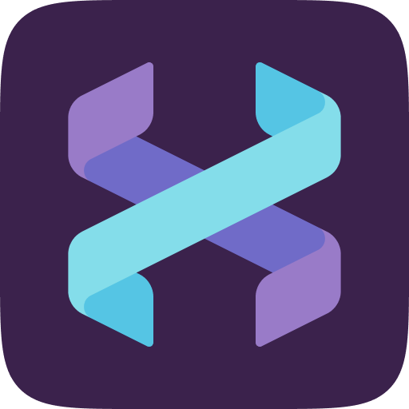 **Helix** | A post-modern modal text editor built in Rust. | [Website](https://helix-editor.com)   [Github](https://github.com/helix-editor/helix) | `Mac` `Windows` `Linux` | Free, Open-Source | `Rust` `Modal` `CLI` |
|  **Micro** | A modern, intuitive terminal-based text editor. | [Website](https://micro-editor.github.io/)   [Github](https://github.com/zyedidia/micro) | `Mac` `Windows` `Linux` | Free, Open-Source | `CLI` `Mouse-Support` |
|  **VSCodium** | Binary releases of VS Code without Microsoft telemetry/branding. | [Website](https://vscodium.com/)   [Github](https://github.com/VSCodium/vscodium) | `Mac` `Windows` `Linux` | Free, Open-Source | `Privacy` `VSCode` |
|  **Geany** | Powerful, stable, and lightweight programmer's text editor. | [Website](https://geany.org)   [Github](https://github.com/geany/geany) | `Mac` `Windows` `Linux` | Free, Open-Source | `Lightweight` `Fast` |
|  **Kate** | Advanced text editor by KDE. | [Website](https://kate-editor.org/)   [GitLab](https://invent.kde.org/utilities/kate) | `Mac` `Windows` `Linux` | Free, Open-Source | `KDE` `Lightweight` |
|  **gedit** | The official text editor of the GNOME desktop environment. | [Website](https://wiki.gnome.org/Apps/Gedit)   [GitLab](https://gitlab.gnome.org/GNOME/gedit) | `Linux` `Mac` `Windows` | Free, Open-Source | `GNOME` `Simple` |
|  **BBEdit** | Leading professional HTML and text editor for macOS. | [Website](https://www.barebones.com/products/bbedit/) | `Mac` | Freemium, Proprietary | `Mac-Native` `Powerful` |
|  **TextMate** | Powerful and customizable text editor for macOS. | [Website](https://macromates.com/)   [Github](https://github.com/textmate/textmate) | `Mac` | Free, Open-Source | `Mac-Native` `Classic` |
|  **CotEditor** | Lightweight plain-text editor for macOS. | [Website](https://coteditor.com/)   [Github](https://github.com/coteditor/CotEditor) | `Mac` | Free, Open-Source | `Mac-Native` `Lightweight` |
|  **Spacemacs** | Community-driven Emacs distribution. "The best of both Emacs and Vim". | [Website](https://www.spacemacs.org/)   [Github](https://github.com/syl20bnr/spacemacs) | `Mac` `Windows` `Linux` `BSD` | Free, Open-Source | `Emacs` `Vim` |
|  **Lite XL** | A lightweight text editor written in Lua. | [Website](https://lite-xl.com)   [Github](https://github.com/lite-xl/lite-xl) | `Mac` `Windows` `Linux` | Free, Open-Source | `Lua` `Lightweight` |
|  **CudaText** | Cross-platform text editor with Python API. | [Website](https://cudatext.github.io/)   [Github](https://github.com/Alexey-T/CudaText) | `Mac` `Windows` `Linux` | Free, Open-Source | `Pascal` `Native` |
| 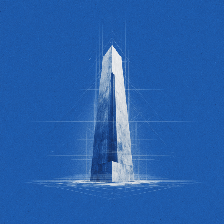 **Athas** | High-performance, Vim-based editor built with Tauri and React. | [Website](https://athas.dev)   [Github](https://github.com/athasdev/athas) | `Mac` `Windows` `Linux` | Free, Open-Source | `Vim` `Web-Tech` |
|  **Fresh Editor** | Modern terminal-based text editor and IDE. | [Website](https://sinelaw.github.io/fresh/)   [Github](https://github.com/sinelaw/fresh) | `Mac` `Linux` | Free, Open-Source | `Terminal` `IDE-Like` |
|  **Graviton** | Minimalistic, cross-platform code editor. | [Website](https://graviton.netlify.app/)   [Github](https://github.com/Graviton-Code-Editor/Graviton-App) | `Mac` `Windows` `Linux` | Free, Open-Source | `Minimal` |
|  **PSPad** | Freeware text and source editor for Windows. | [Website](http://www.pspad.com/) | `Windows` | Free | `Classic` |
|  **EmEditor** | Fast, lightweight, yet extensible text editor for Windows. Great for large files. | [Website](https://www.emeditor.com/) | `Windows` | Paid | `Large-Files` |
|  **SciTE** | CheckOut Scintilla Text Editor. | [Website](https://www.scintilla.org/SciTE.html)   [Github](https://github.com/ScintillaOrg/lexilla) | `Windows` `Linux` | Free, Open-Source | `Minimal` |
|  **Bluefish** | Powerful editor targeted towards programmers and web developers. | [Website](http://bluefish.openoffice.nl/) | `Mac` `Windows` `Linux` | Free, Open-Source | `Fast` |
| 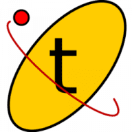 **Textadept** | Fast, minimalist, and extensible cross-platform text editor. | [Website](https://orbitalquark.github.io/textadept/)   [Github](https://github.com/orbitalquark/textadept) | `Mac` `Windows` `Linux` | Free, Open-Source | `Lua` `Minimal` |
| 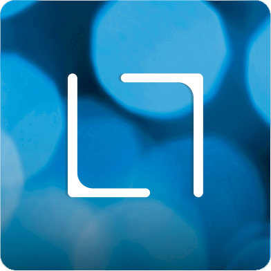 **Light Table** | Next generation code editor. (Legacy). | [Website](http://lighttable.com/)   [Github](https://github.com/LightTable/LightTable) | `Mac` `Windows` `Linux` | Free, Open-Source | `ClojureScript` `Legacy` |
|  **Leafpad** | Simple GTK+ text editor. | [Website](http://tarot.freeshell.org/leafpad/) | `Linux` | Free, Open-Source | `Simple` |
|  **BBEdit** | (Discontinued) Replaced by BBEdit. | [Website](https://www.barebones.com/products/textwrangler/) | `Mac` | Free | `Legacy` |

## Language-Specific IDEs

While many general IDEs support these languages, the following are specialized or "Best-in-Class" for specific ecosystems.

### PHP

| Name | Description | Links | System Support | Fees | Tags |
| :--- | :--- | :--- | :--- | :--- | :--- |
|  **PhpStorm** | Lightning-smart PHP IDE by JetBrains. | [Website](https://www.jetbrains.com/phpstorm/) | `Mac` `Windows` `Linux` | Paid | `PHP` `Web` |

### Go

| Name | Description | Links | System Support | Fees | Tags |
| :--- | :--- | :--- | :--- | :--- | :--- |
|  **GoLand** | Capable and ergonomic Go IDE by JetBrains. | [Website](https://www.jetbrains.com/go/) | `Mac` `Windows` `Linux` | Paid | `Go` `Microservices` |

### Rust

| Name | Description | Links | System Support | Fees | Tags |
| :--- | :--- | :--- | :--- | :--- | :--- |
| 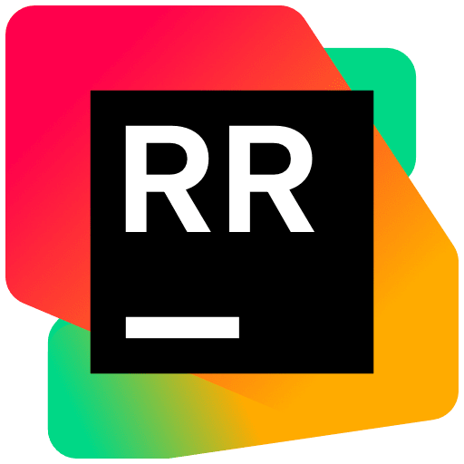 **RustRover** | Dedicated Rust IDE by JetBrains. | [Website](https://www.jetbrains.com/rust/) | `Mac` `Windows` `Linux` | Paid | `Rust` `Native` |

### Python

| Name | Description | Links | System Support | Fees | Tags |
| :--- | :--- | :--- | :--- | :--- | :--- |
|  **PyCharm** | The premier Python IDE with code analysis, graphical debugger, and Django support. | [Website](https://www.jetbrains.com/pycharm/) | `Mac` `Windows` `Linux` | Freemium, Proprietary | `Intelligent` `Web` `Data-Science` |
|  **Spyder** | A scientific environment written in Python, for Python. Great for data analysts. | [Website](https://www.spyder-ide.org/) | `Mac` `Windows` `Linux` | Free, Open-Source | `Scientific` `Data-Analysis` |
|  **Thonny** | Python IDE for beginners. | [Website](https://thonny.org/)   [Github](https://github.com/thonny/thonny) | `Mac` `Windows` `Linux` | Free, Open-Source | `Education` `Beginner` |
|  **Wing IDE** | Powerful Python IDE with powerful debugger and intelligent editor. | [Website](https://wingware.com/) | `Mac` `Windows` `Linux` | Paid, Freemium | `Python` |
|  **PyDev** | Python IDE for Eclipse. | [Website](https://www.pydev.org/) | `Mac` `Windows` `Linux` | Free, Open-Source | `Eclipse` `Plugin` |
|  **Eric** | Full featured Python editor and IDE, written in Python. | [Website](https://eric-ide.python-projects.org/) | `Mac` `Windows` `Linux` | Free, Open-Source | `Python` `Qt` |
|  **PyScripter** | Lightweight, open-source Python IDE for Windows. | [Github](https://github.com/pyscripter/pyscripter) | `Windows` | Free, Open-Source | `Lightweight` |
|  **IEP (Pyzo)** | Cross-platform Python IDE focused on interactivity and introspection. | [Website](https://pyzo.org/) | `Mac` `Windows` `Linux` | Free, Open-Source | `Science` |

### Java

| Name | Description | Links | System Support | Fees | Tags |
| :--- | :--- | :--- | :--- | :--- | :--- |
|  **IntelliJ IDEA** | Capable and ergonomic IDE for JVM languages. deeply intelligent coding assistance. | [Website](https://www.jetbrains.com/idea/) | `Mac` `Windows` `Linux` | Freemium, Proprietary | `Java` `Kotlin` `Enterprise` |
|  **Eclipse** | Famous open-source IDE, widely used for Java and legacy enterprise applications. | [Website](https://www.eclipse.org/) | `Mac` `Windows` `Linux` | Free, Open-Source | `Java` `Plugin-Ecosystem` |
|  **NetBeans** | Official IDE for Java 8. Good support to modular applications. | [Website](https://netbeans.apache.org/)   [Github](https://github.com/apache/netbeans) | `Mac` `Windows` `Linux` | Free, Open-Source | `Java` `Swing` |

### C/C++

| Name | Description | Links | System Support | Fees | Tags |
| :--- | :--- | :--- | :--- | :--- | :--- |
|  **CLion** | Cross-platform C/C++ IDE by JetBrains. Uses CMake natively. | [Website](https://www.jetbrains.com/clion/) | `Mac` `Windows` `Linux` | Paid | `CMake` `Embedded` |
|  **Qt Creator** | Designed for developing applications with the Qt framework. | [Website](https://www.qt.io/) | `Mac` `Windows` `Linux` | Freemium | `Qt` `GUI` |
|  **Code::Blocks** | Open-source C/C++ IDE built to meet the most demanding needs of its users. | [Website](http://www.codeblocks.org/) | `Windows` `Linux` | Free, Open-Source | `Lightweight` |
|  **KDevelop** | Cross-platform IDE for C, C++, Python, QML/JavaScript and PHP. | [Website](https://apps.kde.org/kdevelop/) | `Windows` `Linux` | Free, Open-Source | `KDE` |
|  **CodeLite** | Lightweight open-source IDE for C/C++/PHP and Node.js. | [Website](https://codelite.org) | `Mac` `Windows` `Linux` | Free, Open-Source | `Lightweight` |
|  **RAD Studio** | Powerful rapid application development suite for GUI-centric apps. | [Website](https://www.embarcadero.com/products/rad-studio) | `Windows` | Paid | `GUI` `Delphi` `C++` |
|  **Dev-C++** | Legacy full-featured IDE for C/C++. | [Website](http://www.bloodshed.net) | `Windows` | Free, Open-Source | `Legacy` `Lightweight` |
|  **Ultimate++** | C++ cross-platform rapid application development framework. | [Website](https://www.ultimatepp.org) | `Windows` `Linux` | Free, Open-Source | `RAD` |
|  **Anjuta** | Versatile IDE for C/C++ on GNU/Linux. | [Website](https://wiki.gnome.org/Apps/Anjuta) | `Linux` | Free, Open-Source | `GNOME` |
|  **Cevelop** | The C++ IDE for professional developers. | [Website](https://www.cevelop.com) | `Mac` `Windows` `Linux` | Free, Paid | `Professional` |
|  **Zinjai** | Designed for use by students of programming. | [Website](https://zinjai.sourceforge.net) | `Mac` `Windows` `Linux` | Free, Open-Source | `Education` |
|  **JCppEdit** | Multi-language environment starting from C/C++ to Java/Web. | [Website](https://www.jcppedit.com) | `Windows` `Linux` | Free, Paid | `Multi-Language` |

### Ruby

| Name | Description | Links | System Support | Fees | Tags |
| :--- | :--- | :--- | :--- | :--- | :--- |
|  **RubyMine** | A dedicated Ruby and Rails IDE with smart assistance. | [Website](https://www.jetbrains.com/ruby/) | `Mac` `Windows` `Linux` | Paid | `Ruby` `Rails` |

## Web Development

| Name | Description | Links | System Support | Fees | Tags |
| :--- | :--- | :--- | :--- | :--- | :--- |
|  **WebStorm** | The smartest JavaScript IDE. Fully equipped for advanced web development. | [Website](https://www.jetbrains.com/webstorm/) | `Mac` `Windows` `Linux` | Paid | `JavaScript` `TypeScript` `Frontend` |
|  **Aptana Studio** | Professional, open-source development tool for the open web. | [Github](https://github.com/aptana/studio3) | `Mac` `Windows` `Linux` | Free, Open-Source | `Web` `Eclipse` |
|  **WeBuilder** | All-in-one web code editor for HTML, CSS, JavaScript, PHP, Ruby, Python, etc. | [Website](https://www.blumentals.net/webuilder/) | `Windows` | Paid | `All-in-One` |
|  **Komodo IDE** | One IDE for all your languages (Python, PHP, Go, Perl, Tcl, Ruby, etc). | [Website](https://www.activestate.com/products/komodo-ide/)   [Github](https://github.com/ActiveState/OpenKomodoIDE) | `Mac` `Windows` `Linux` | Free (ActiveState) | `Polyglot` `Legacy` |
|  **Firebase Studio** | Web-based toolset for Firebase development. | [Website](https://firebase.studio/) | `Web` | Free | `Firebase` |

## Mobile Development

| Name | Description | Links | System Support | Fees | Tags |
| :--- | :--- | :--- | :--- | :--- | :--- |
|  **Android Studio** | Official IDE for Android development. Based on IntelliJ IDEA. | [Website](https://developer.android.com/studio) | `Mac` `Windows` `Linux` | Free, Open-Source | `Android` `Kotlin` |
|  **Xcode** | The only IDE for developing fully functional iOS/macOS apps. | [Website](https://developer.apple.com/xcode/) | `Mac` | Free, Proprietary | `iOS` `Swift` `macOS` |
|  **Squircle IDE** | A fast multi-language code editor for Android devices. | [Github](https://github.com/massivemadness/Squircle-CE) | `Android` | Free, Open-Source | `Mobile-on-Mobile` |
|  **CppDroid** | simple C/C++ IDE focused on learning. | [PlayStore](https://play.google.com/store/apps/details?id=name.antonsmirnov.android.cppdroid) | `Android` | Freemium | `Mobile-on-Mobile` |
| 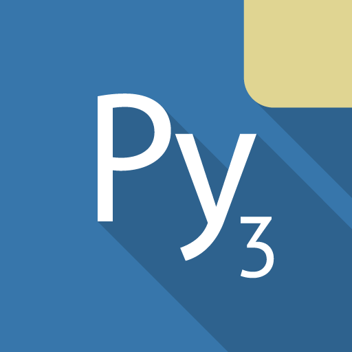 **Pydroid 3** | Easy to use educational Python 3 IDE for Android. | [PlayStore](https://play.google.com/store/apps/details?id=ru.iiec.pydroid3) | `Android` | Freemium | `Python` `Mobile` |
|  **Cosmic IDE** | JVM (Java/Kotlin) IDE for Android. | [Github](https://github.com/Cosmic-IDE/Cosmic-IDE) | `Android` | Free, Open-Source | `Java` `Kotlin` |

## Data Science

| Name | Description | Links | System Support | Fees | Tags |
| :--- | :--- | :--- | :--- | :--- | :--- |
|  **Jupyter** | Open-source web application for interactive computing and notebooks. | [Website](https://jupyter.org/) | `Web` `All Platforms` | Free, Open-Source | `Notebooks` `Python` `R` |
|  **RStudio** | The premier IDE for R. Integrated tools for plotting, history, and workspace. | [Website](https://rstudio.com/) | `Mac` `Windows` `Linux` | Free, Open-Source | `R` `Statistics` |
| 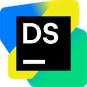 **DataSpell** | The IDE for Data Science by JetBrains. | [Website](https://www.jetbrains.com/dataspell/) | `Mac` `Windows` `Linux` | Paid | `Jupyter` `Python` |
|  **Zasper** | AI-native IDE for Data Science. "Cursor for Data Science". | [Website](https://zasper.io)   [Github](https://github.com/zasper-io/zasper) | `Web` | Free (Preview) | `AI` `Notebooks` |

## Game Development

| Name | Description | Links | System Support | Fees | Tags |
| :--- | :--- | :--- | :--- | :--- | :--- |
|  **Unity** | Real-time 3D development platform for building games and AR/VR experiences. | [Website](https://unity.com/) | `Mac` `Windows` `Linux` | Freemium | `3D` `C#` |
|  **Unreal Engine** | High-fidelity game engine used for AAA games and cinema. | [Website](https://www.unrealengine.com/) | `Mac` `Windows` `Linux` | Freemium | `AAA` `C++` `Visual-Scripting` |
|  **Godot** | Feature-packed, cross-platform, open-source game engine. | [Website](https://godotengine.org/)   [Github](https://github.com/godotengine/godot) | `Mac` `Windows` `Linux` | Free, Open-Source | `Lightweight` `2D/3D` |
|  **CryEngine** | A game engine known for its impressive visual fidelity and real-time physics. | [Website](https://www.cryengine.com/) | `Windows` | Free, Proprietary | `AAA` `Visuals` |
|  **GameMaker** | The ultimate 2D game development environment. | [Website](https://www.yoyogames.com/gamemaker) | `Windows` `Mac` | Paid | `2D` `Beginner-Friendly` |
|  **Construct** | Visual game engine for creating 2D games without coding. | [Website](https://www.construct.net/) | `Web` `Windows` | Paid | `No-Code` `2D` |
|  **Defold** | focused on 2D game development and ease of use. | [Website](https://defold.com/)   [Github](https://github.com/defold/defold) | `Mac` `Windows` `Linux` | Free, Open-Source | `2D` `Lightweight` |
|  **Stride** | Open-source 3D game engine (formerly Xenko). | [Website](https://stride3d.net/)   [Github](https://github.com/stride3d/stride) | `Windows` | Free, Open-Source | `.NET` `C#` |
|  **Hazel** | Early-stage interactive application and rendering engine. | [Github](https://github.com/TheCherno/Hazel) | `Windows` | Free, Open-Source | `Learning` `Rendering` |
|  **Open 3D Engine** | AAA-capable, open-source 3D engine. | [Website](https://o3de.org)   [Github](https://github.com/o3de/o3de) | `Windows` `Linux` | Free, Open-Source | `AAA` `3D` |
|  **Redot Engine** | Community-driven fork of Godot Engine. | [Website](https://redotengine.org)   [Github](https://github.com/Redot-Engine/redot-engine) | `Mac` `Windows` `Linux` `Android` | Free, Open-Source | `Godot-Fork` `2D/3D` |
|  **MicroStudio** | Online game engine for learning and prototyping. | [Website](https://microstudio.dev)   [Github](https://github.com/pmgl/microstudio) | `Web` `Mac` `Windows` `Linux` | Free, Open-Source | `Web` `Learning` |
|  **Bevy** | A data-driven game engine built in Rust. | [Website](https://bevyengine.org)   [Github](https://github.com/bevyengine/bevy) | `Mac` `Windows` `Linux` `Web` | Free, Open-Source | `Rust` `ECS` |
|  **Verge3D** | Toolkit for creating immersive web-based 3D experiences (Blender/Max/Maya). | [Website](https://www.soft8soft.com/verge3d/) | `Web` `Blender` | Paid | `Web` `No-Code` |
|  **PlayCanvas** | Cloud-first web game engine. Collaborative 3D development. | [Website](https://playcanvas.com)   [Github](https://github.com/playcanvas/engine) | `Web` | Freemium | `Cloud` `Web` |
|  **Torque 3D** | Open-source C++ engine with a long history. | [Website](https://torque3d.org)   [Github](https://github.com/TorqueGameEngines/Torque3D) | `Windows` `Mac` `Linux` | Free, Open-Source | `C++` `Legacy` |
| 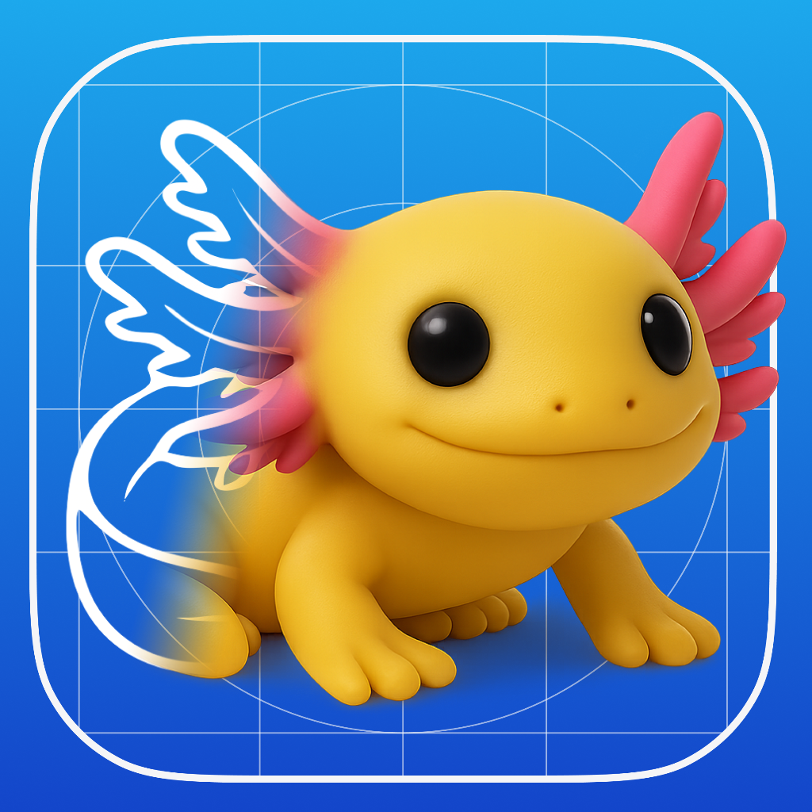 **XoGot** | Godot engine adapted for iPadOS development. | [Website](https://xogot.com) | `iOS` | Freemium | `iPad` `Mobile` |
|  **Flax Engine** | High-quality 3D engine with C++ and C# scripting. | [Website](https://flaxengine.com)   [Github](https://github.com/FlaxEngine/FlaxEngine) | `Windows` `Mac` `Linux` | Free (Royalties) | `C++` `C#` |
|  **Source SDK** | Tools for creating mods and games for Valve's Source Engine. | [Website](https://developer.valvesoftware.com/wiki/Source_SDK) | `Windows` `Linux` | Free | `Modding` `Valve` |
|  **Wicked Engine** | Modern C++ engine focusing on rendering performance. | [Website](https://wickedengine.net)   [Github](https://github.com/turanszkij/WickedEngine) | `Windows` `Linux` | Free, Open-Source | `C++` `Rendering` |
| 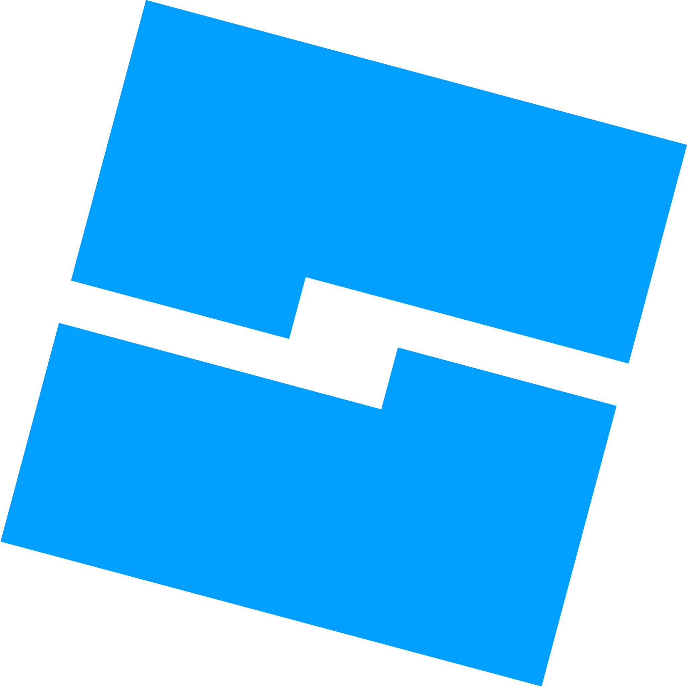 **Roblox Studio** | The tool for creating games on the Roblox platform. | [Website](https://www.roblox.com/create) | `Windows` `Mac` | Free (Rev Share) | `Lua` `Platform` |
|  **EzEngine** | Modular C++ game engine. | [Website](https://ezengine.net)   [Github](https://github.com/ezEngine/ezEngine) | `Windows` `Linux` | Free, Open-Source | `C++` `Modular` |
|  **Harfang 3D** | Multi-language 3D engine (Python, Lua, C++). | [Website](https://www.harfang3d.com) | `Windows` `Linux` | Freemium | `Python` `Lua` |
|  **Enigma** | Open-source game development environment compatible with Game Maker. | [Website](https://enigma-dev.org)   [Github](https://github.com/enigma-dev/enigma-dev) | `Windows` `Mac` `Linux` | Free, Open-Source | `GameMaker` |
|  **Hology** | Web-first game engine for browser games. | [Website](https://hology.app) | `Web` | Free | `Web` `Browser` |
|  **Evergine (Wave)** | Industrial-grade component-based engine (formerly Wave Engine). | [Website](https://evergine.com) | `Windows` | Free | `.NET` `C#` |
|  **Fyrox** | Feature-rich game engine written in Rust. | [Website](https://fyrox.rs)   [Github](https://github.com/FyroxEngine/Fyrox) | `Windows` `Mac` `Linux` | Free, Open-Source | `Rust` |
| 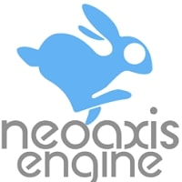 **NeoAxis** | Versatile 3D/2D engine with C# scripting. | [Website](https://www.neoaxis.com) | `Windows` | Free (Royalties) | `C#` |
|  **Rogue Engine** | Unity-like environment for Three.js (Web). | [Website](https://rogueengine.io) | `Web` | Free, Open-Source | `Three.js` `Web` |
|  **Amethyst** | Data-driven game engine written in Rust (Maintenance Mode). | [Github](https://github.com/amethyst/amethyst) | `Windows` `Mac` `Linux` | Free, Open-Source | `Rust` `Legacy` |
|  **Leadwerks** | Easy-to-learn game engine for C++ and Lua. | [Website](https://www.leadwerks.com) | `Windows` `Linux` | Paid | `C++` `Lua` |
| 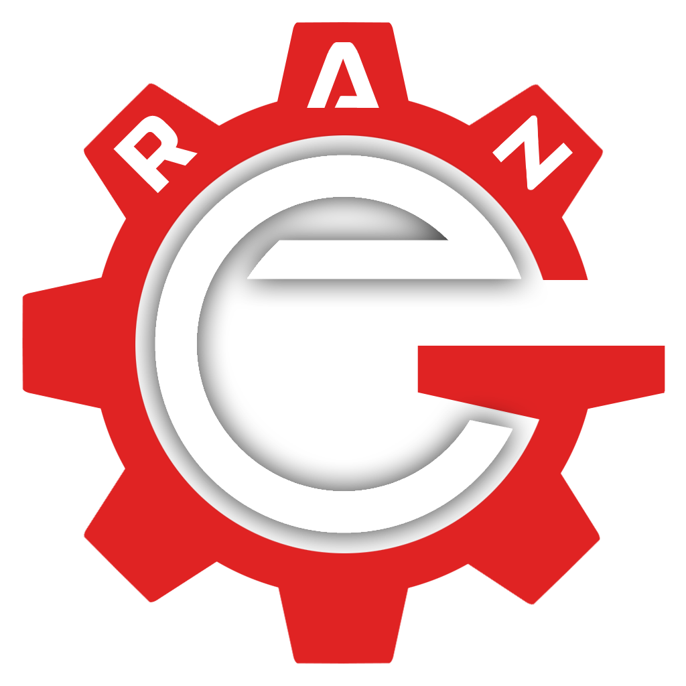 **Range Engine** | Game engine based on Blender. | [Website](https://rangeengine.tech) | `Windows` `Linux` | Free, Open-Source | `Blender` |
| 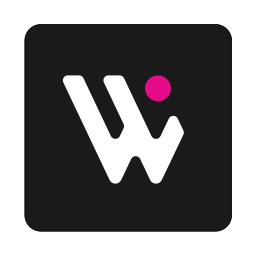 **Wonderland Engine** | Development platform for WebXR and 3D web. | [Website](https://wonderlandengine.com) | `Web` | Freemium | `WebXR` `Web` |
|  **Verus Engine** | High-performance C++ game engine. | [Website](https://en.verushub.com/)   [Github](https://github.com/dmaluev/verus) | `Windows` | Free, Open-Source | `C++` |
|  **Nau Engine** | Open-source engine for creating games on all platforms. | [Website](https://nauengine.org)   [Github](https://github.com/NauEngine) | `Windows` `Mac` `Linux` | Free, Open-Source | `C++` |
| 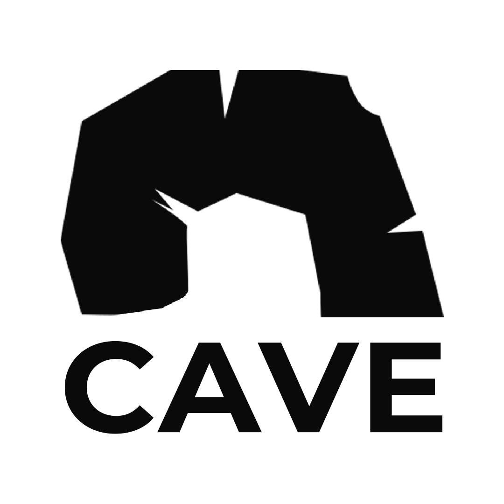 **Cave Engine** | Python-powered 3D game engine. | [Website](https://uniday.studio/cave/) | `Windows` | Free | `Python` |

## Embedded Systems

| Name | Description | Links | System Support | Fees | Tags |
| :--- | :--- | :--- | :--- | :--- | :--- |
|  **PlatformIO** | Professional collaborative platform for embedded development. | [Website](https://platformio.org/) | `Plugin (VSCode, etc)` | Free, Open-Source | `IoT` `Embedded` |
|  **AvalonStudio** | Cross platform IDE for Embedded C/C++ and .NET Core. | [Github](https://github.com/VitalElement/AvalonStudio) | `Mac` `Windows` `Linux` | Free, Open-Source | `.NET` `Embedded` |
|  **ElectronIDE** | Web based Arduino IDE. | [Github](https://github.com/joshmarinacci/ElectronIDE) | `Mac` `Windows` `Linux` `Web` | Free, Open-Source | `Arduino` |

## Version Control & Tools

| Name | Description | Links | System Support | Fees | Tags |
| :--- | :--- | :--- | :--- | :--- | :--- |
|  **Git** | Distributed version control system. | [Website](https://git-scm.com/) | `Mac` `Windows` `Linux` `BSD` | Free, Open-Source | `VCS` |
|  **GitHub** | Hosting service for software development and version control using Git. | [Website](https://github.com/) | `Web` | Freemium | `Hosting` `Collaboration` |
|  **Judge0** | Robust, scalable, and open-source online code execution system. | [Website](https://judge0.com/)   [Github](https://github.com/judge0/judge0) | `Web` `API` | Free, Open-Source | `Compiler-API` |

## Contributing

Contributions are welcome! Please read the [contribution guidelines](CONTRIBUTING.md) first.

## License

Licensed under the [Creative Commons Attribution 4.0 International License](LICENSE).

---
*Disclaimer: Usage of icons is for identification purposes only.*
