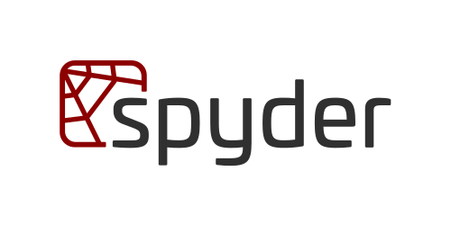
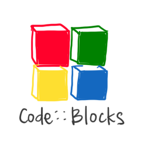
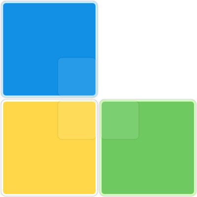

# Awesome-IDEs

Welcome to **Awesome-IDEs**, a curated list of Integrated Development Environments (IDEs) and intelligent code editors. This list aims to help you discover the perfect environment for your workflow, whether you need a lightweight editor, a robust integrated environment, or a next-generation AI-powered assistant.

## Table of Contents

- [Introduction](#introduction)
- [AI-Powered & Next-Gen IDEs](#ai-powered--next-gen-ides)
- [General Purpose IDEs](#general-purpose-ides)
- [Language-Specific IDEs](#language-specific-ides)
    - [Python](#python)
    - [Java](#java)
    - [C/C++](#cc)
    - [Ruby](#ruby)
- [Web Development](#web-development)
- [Mobile Development](#mobile-development)
- [Data Science](#data-science)
- [Game Development](#game-development)
- [Embedded Systems](#embedded-systems)
- [Version Control & Tools](#version-control--tools)
- [Contributing](#contributing)
- [License](#license)

## Introduction

Choosing the right IDE can significantly impact your productivity. The landscape is evolving rapidly, with a new wave of **AI-First IDEs** changing how we write code. This list categorizes structured environments by their primary focus, while using **Tags** to highlight cross-capabilities (like Web support in a Java IDE or AI integration).

**Key to Tags:**
- `AI-Native`: Built from the ground up for AI.
- `AI-Ready`: Has strong, official AI plugins or integrations.
- `Lightweight`: Fast startup, low resource usage.
- `Polyglot`: Excellent support for many languages.

## AI-Powered & Next-Gen IDEs

These IDEs are built with Artificial Intelligence at their core or represent the next generation of high-performance editors.

| Name | Description | Links | System Support | Fees | Tags |
| :--- | :--- | :--- | :--- | :--- | :--- |
|  **Cursor** | An AI-first code editor built on top of VS Code. It understands your entire codebase and allows for natural language coding and diff revisions. | [Website](https://cursor.com/) | `Mac` `Windows` `Linux` | Freemium, Proprietary | `AI-Native` `Fork-of-VSCode` |
|  **Windsurf** | The first "agentic" IDE by Codeium. It features "Flow" to keep context of your work and can act autonomously to refactor or generate code. | [Website](https://codeium.com/windsurf) | `Mac` `Windows` `Linux` | Freemium, Proprietary | `AI-Native` `Agentic` |
|  **Zed** | A high-performance, multiplayer code editor written in Rust. Designed for speed and collaboration with built-in AI chat. | [Website](https://zed.dev/)   [Github](https://github.com/zed-industries/zed) | `Mac` `Linux` `Windows (Preview)` | Free, Open-Source | `High-Performance` `Rust` `AI-Integrated` |
|  **Trae** | An adaptive AI IDE that offers a "Builder Mode" to automate end-to-end development tasks. | [Website](https://trae.ai/) | `Mac` `Windows` | Free, Proprietary | `AI-Native` |
|  **Theia IDE** | An extensible, adaptable platform compatible with VS Code extensions, featuring transparent AI coding. | [Website](https://theia-ide.org/)   [Github](https://github.com/eclipse-theia/theia) | `Mac` `Windows` `Linux` `Online` | Free, Open-Source | `Cloud-Ready` `Extensible` |
|  **JetBrains Fleet** | A distributed, polyglot IDE built from scratch by JetBrains. Uses the IntelliJ engine but with a lightweight UI. | [Website](https://www.jetbrains.com/fleet) | `Mac` `Windows` `Linux` | Freemium, Proprietary | `Distributed` `Polyglot` |

## General Purpose IDEs

Versatile editors and IDEs that support a wide array of languages and workflows via plugins.

| Name | Description | Links | System Support | Fees | Tags |
| :--- | :--- | :--- | :--- | :--- | :--- |
|  **Visual Studio Code** | The most popular code editor, highly customizable with a massive extension marketplace. | [Website](https://code.visualstudio.com/)   [Github](https://github.com/microsoft/vscode) | `Mac` `Windows` `Linux` `Web` | Free, Open-Source | `Polyglot` `Extensible` `AI-Ready` |
|  **Visual Studio** | A comprehensive IDE for .NET and C++ development, widely used in enterprise environments. | [Website](https://visualstudio.microsoft.com/) | `Windows` `Mac` | Freemium, Proprietary | `Enterprise` `.NET` `C++` |
|  **Vim** | A highly configurable text editor for efficient text editing. Often used as an IDE by power users. | [Website](https://www.vim.org/) | `All Platforms` | Free, Open-Source | `CLI` `Lightweight` |
|  **Emacs** | An extensible, customizable, self-documenting display editor. "An OS inside an editor". | [Website](https://www.gnu.org/software/emacs/) | `All Platforms` | Free, Open-Source | `CLI` `Lisp` `Extensible` |
|  **UltraEdit** | A powerful commercial text editor for handling large files and complex editing tasks. | [Website](https://www.ultraedit.com/) | `Mac` `Windows` `Linux` | Paid | `Text-Processing` `Hex` |
|  **Lapce** | A lightning-fast, open-source code editor written in Rust. | [Website](https://lap.dev/lapce/) | `Mac` `Windows` `Linux` | Free, Open-Source | `Rust` `Fast` |
|  **Geany** | Powerful, stable, and lightweight programmer's text editor. | [Website](https://geany.org) | `Mac` `Windows` `Linux` | Free, Open-Source | `Lightweight` `Fast` |

## Language-Specific IDEs

While many general IDEs support these languages, the following are specialized or "Best-in-Class" for specific ecosystems.

### Python

| Name | Description | Links | System Support | Fees | Tags |
| :--- | :--- | :--- | :--- | :--- | :--- |
|  **PyCharm** | The premier Python IDE with code analysis, graphical debugger, and Django support. | [Website](https://www.jetbrains.com/pycharm/) | `Mac` `Windows` `Linux` | Freemium, Proprietary | `Intelligent` `Web` `Data-Science` |
|  **Spyder** | A scientific environment written in Python, for Python. Great for data analysts. | [Website](https://www.spyder-ide.org/) | `Mac` `Windows` `Linux` | Free, Open-Source | `Scientific` `Data-Analysis` |

### Java

| Name | Description | Links | System Support | Fees | Tags |
| :--- | :--- | :--- | :--- | :--- | :--- |
|  **IntelliJ IDEA** | Capable and ergonomic IDE for JVM languages. deeply intelligent coding assistance. | [Website](https://www.jetbrains.com/idea/) | `Mac` `Windows` `Linux` | Freemium, Proprietary | `Java` `Kotlin` `Enterprise` |
|  **Eclipse** | Famous open-source IDE, widely used for Java and legacy enterprise applications. | [Website](https://www.eclipse.org/) | `Mac` `Windows` `Linux` | Free, Open-Source | `Java` `Plugin-Ecosystem` |
|  **NetBeans** | Official IDE for Java 8. Good support to modular applications. | [Website](https://netbeans.apache.org/) | `Mac` `Windows` `Linux` | Free, Open-Source | `Java` `Swing` |

### C/C++

| Name | Description | Links | System Support | Fees | Tags |
| :--- | :--- | :--- | :--- | :--- | :--- |
|  **CLion** | Cross-platform C/C++ IDE by JetBrains. Uses CMake natively. | [Website](https://www.jetbrains.com/clion/) | `Mac` `Windows` `Linux` | Paid | `CMake` `Embedded` |
|  **Qt Creator** | Designed for developing applications with the Qt framework. | [Website](https://www.qt.io/) | `Mac` `Windows` `Linux` | Freemium | `Qt` `GUI` |
|  **Code::Blocks** | Open-source C/C++ IDE built to meet the most demanding needs of its users. | [Website](http://www.codeblocks.org/) | `Windows` `Linux` | Free, Open-Source | `Lightweight` |
|  **KDevelop** | Cross-platform IDE for C, C++, Python, QML/JavaScript and PHP. | [Website](https://apps.kde.org/kdevelop/) | `Windows` `Linux` | Free, Open-Source | `KDE` |
|  **CodeLite** | Lightweight open-source IDE for C/C++/PHP and Node.js. | [Website](https://codelite.org) | `Mac` `Windows` `Linux` | Free, Open-Source | `Lightweight` |
|  **RAD Studio** | Powerful rapid application development suite for GUI-centric apps. | [Website](https://www.embarcadero.com/products/rad-studio) | `Windows` | Paid | `GUI` `Delphi` `C++` |
|  **Dev-C++** | Legacy full-featured IDE for C/C++. | [Website](http://www.bloodshed.net) | `Windows` | Free, Open-Source | `Legacy` `Lightweight` |
|  **Ultimate++** | C++ cross-platform rapid application development framework. | [Website](https://www.ultimatepp.org) | `Windows` `Linux` | Free, Open-Source | `RAD` |
|  **Anjuta** | Versatile IDE for C/C++ on GNU/Linux. | [Website](https://wiki.gnome.org/Apps/Anjuta) | `Linux` | Free, Open-Source | `GNOME` |
|  **Cevelop** | The C++ IDE for professional developers. | [Website](https://www.cevelop.com) | `Mac` `Windows` `Linux` | Free, Paid | `Professional` |
|  **Zinjai** | Designed for use by students of programming. | [Website](https://zinjai.sourceforge.net) | `Mac` `Windows` `Linux` | Free, Open-Source | `Education` |
|  **JCppEdit** | Multi-language environment starting from C/C++ to Java/Web. | [Website](https://www.jcppedit.com) | `Windows` `Linux` | Free, Paid | `Multi-Language` |

### Ruby

| Name | Description | Links | System Support | Fees | Tags |
| :--- | :--- | :--- | :--- | :--- | :--- |
|  **RubyMine** | A dedicated Ruby and Rails IDE with smart assistance. | [Website](https://www.jetbrains.com/ruby/) | `Mac` `Windows` `Linux` | Paid | `Ruby` `Rails` |

## Web Development

| Name | Description | Links | System Support | Fees | Tags |
| :--- | :--- | :--- | :--- | :--- | :--- |
|  **WebStorm** | The smartest JavaScript IDE. Fully equipped for advanced web development. | [Website](https://www.jetbrains.com/webstorm/) | `Mac` `Windows` `Linux` | Paid | `JavaScript` `TypeScript` `Frontend` |

## Mobile Development

| Name | Description | Links | System Support | Fees | Tags |
| :--- | :--- | :--- | :--- | :--- | :--- |
|  **Android Studio** | Official IDE for Android development. Based on IntelliJ IDEA. | [Website](https://developer.android.com/studio) | `Mac` `Windows` `Linux` | Free, Open-Source | `Android` `Kotlin` |
|  **Xcode** | The only IDE for developing fully functional iOS/macOS apps. | [Website](https://developer.apple.com/xcode/) | `Mac` | Free, Proprietary | `iOS` `Swift` `macOS` |
|  **Squircle IDE** | A fast multi-language code editor for Android devices. | [Github](https://github.com/massivemadness/Squircle-CE) | `Android` | Free, Open-Source | `Mobile-on-Mobile` |
|  **CppDroid** | simple C/C++ IDE focused on learning. | [PlayStore](https://play.google.com/store/apps/details?id=name.antonsmirnov.android.cppdroid) | `Android` | Freemium | `Mobile-on-Mobile` |

## Data Science

| Name | Description | Links | System Support | Fees | Tags |
| :--- | :--- | :--- | :--- | :--- | :--- |
|  **Jupyter** | Open-source web application for interactive computing and notebooks. | [Website](https://jupyter.org/) | `Web` `All Platforms` | Free, Open-Source | `Notebooks` `Python` `R` |
|  **RStudio** | The premier IDE for R. Integrated tools for plotting, history, and workspace. | [Website](https://rstudio.com/) | `Mac` `Windows` `Linux` | Free, Open-Source | `R` `Statistics` |

## Game Development

| Name | Description | Links | System Support | Fees | Tags |
| :--- | :--- | :--- | :--- | :--- | :--- |
|  **Unity** | Real-time 3D development platform for building games and AR/VR experiences. | [Website](https://unity.com/) | `Mac` `Windows` `Linux` | Freemium | `3D` `C#` |
|  **Unreal Engine** | High-fidelity game engine used for AAA games and cinema. | [Website](https://www.unrealengine.com/) | `Mac` `Windows` `Linux` | Freemium | `AAA` `C++` `Visual-Scripting` |
|  **Godot** | Feature-packed, cross-platform, open-source game engine. | [Website](https://godotengine.org/) | `Mac` `Windows` `Linux` | Free, Open-Source | `Lightweight` `2D/3D` |
|  **CryEngine** | A game engine known for its impressive visual fidelity and real-time physics. | [Website](https://www.cryengine.com/) | `Windows` | Free, Proprietary | `AAA` `Visuals` |
|  **GameMaker** | The ultimate 2D game development environment. | [Website](https://www.yoyogames.com/gamemaker) | `Windows` `Mac` | Paid | `2D` `Beginner-Friendly` |
|  **Construct** | Visual game engine for creating 2D games without coding. | [Website](https://www.construct.net/) | `Web` `Windows` | Paid | `No-Code` `2D` |
|  **Defold** | focused on 2D game development and ease of use. | [Website](https://defold.com/) | `Mac` `Windows` `Linux` | Free, Open-Source | `2D` `Lightweight` |
|  **Stride** | Open-source 3D game engine (formerly Xenko). | [Website](https://stride3d.net/) | `Windows` | Free, Open-Source | `.NET` `C#` |
|  **Hazel** | Early-stage interactive application and rendering engine. | [Github](https://github.com/TheCherno/Hazel) | `Windows` | Free, Open-Source | `Learning` `Rendering` |
|  **Open 3D Engine** | AAA-capable, open-source 3D engine. | [Website](https://o3de.org) | `Windows` `Linux` | Free, Open-Source | `AAA` `3D` |

## Embedded Systems

| Name | Description | Links | System Support | Fees | Tags |
| :--- | :--- | :--- | :--- | :--- | :--- |
|  **PlatformIO** | Professional collaborative platform for embedded development. | [Website](https://platformio.org/) | `Plugin (VSCode, etc)` | Free, Open-Source | `IoT` `Embedded` |
|  **AvalonStudio** | Cross platform IDE for Embedded C/C++ and .NET Core. | [Github](https://github.com/VitalElement/AvalonStudio) | `Mac` `Windows` `Linux` | Free, Open-Source | `.NET` `Embedded` |
|  **ElectronIDE** | Web based Arduino IDE. | [Github](https://github.com/joshmarinacci/ElectronIDE) | `Mac` `Windows` `Linux` `Web` | Free, Open-Source | `Arduino` |

## Version Control & Tools

| Name | Description | Links | System Support | Fees | Tags |
| :--- | :--- | :--- | :--- | :--- | :--- |
|  **Git** | Distributed version control system. | [Website](https://git-scm.com/) | `All Platforms` | Free, Open-Source | `VCS` |
|  **GitHub** | Hosting service for software development and version control using Git. | [Website](https://github.com/) | `Web` | Freemium | `Hosting` `Collaboration` |

## Contributing

Contributions are welcome! Please read the [contribution guidelines](CONTRIBUTING.md) first.

## License

Licensed under the [Creative Commons Attribution 4.0 International License](LICENSE).

---
*Disclaimer: Usage of icons is for identification purposes only.*
