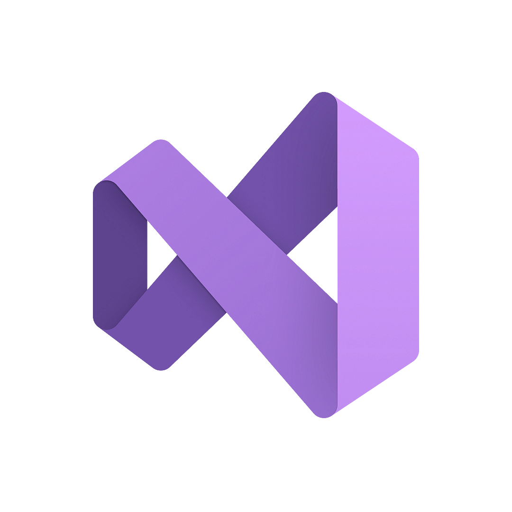
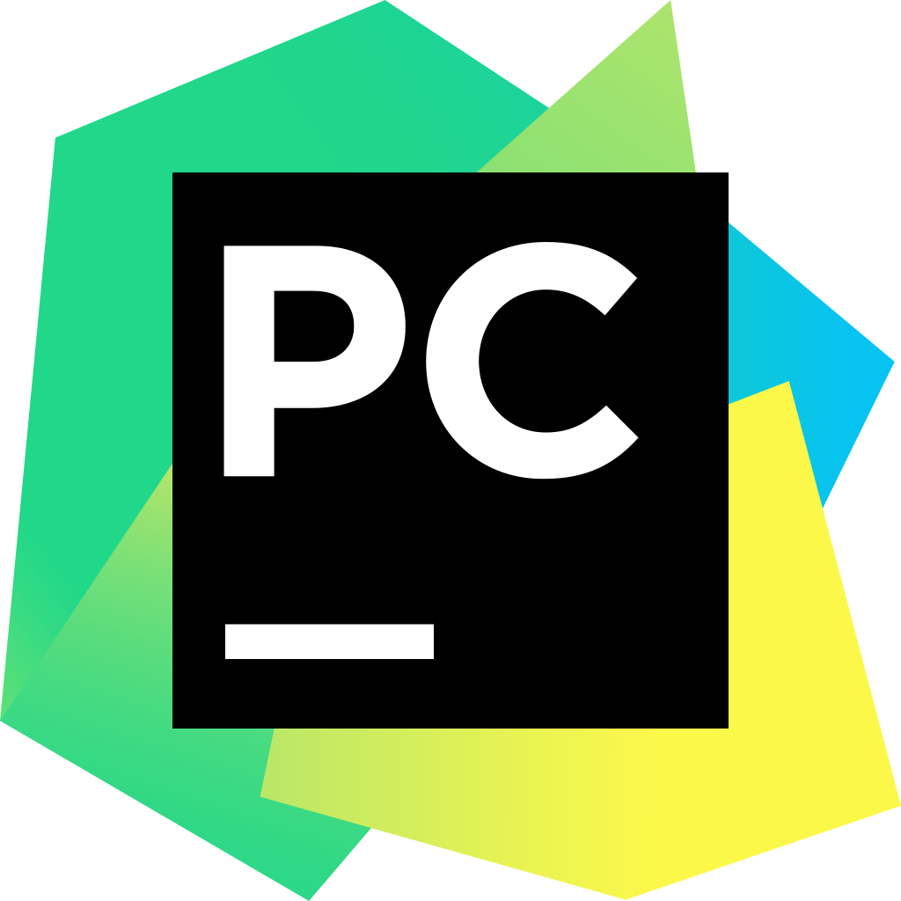
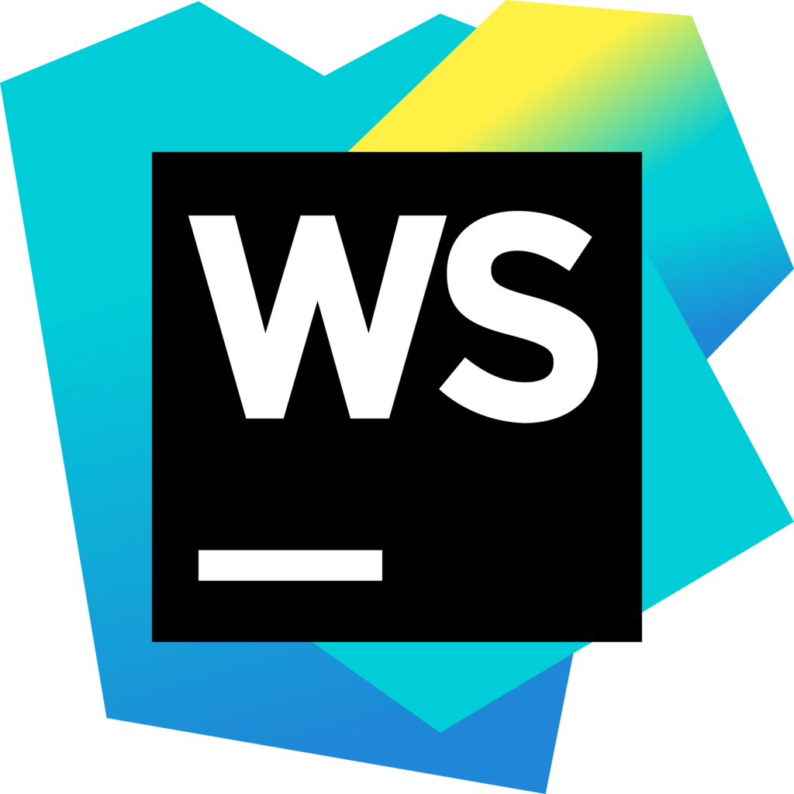

**Awesome-IDEs**

Welcome to Awesome-IDEs, a curated list of Integrated Development Environments (IDEs) and related tools that can enhance your coding experience and boost your productivity. Whether you're a beginner programmer or an experienced developer, finding the right IDE can significantly impact your workflow and make coding a breeze. This repository aims to gather a comprehensive collection of IDEs, categorized by programming languages, platforms, and features, to help you discover the perfect environment for your projects.

## Table of Contents

- [Table of Contents](#table-of-contents)
- [Introduction](#introduction)
- [General Purpose IDEs](#general-purpose-ides)
- [Language-Specific IDEs](#language-specific-ides)
  - [Python](#python)
  - [Java](#java)
  - [C/C++](#cc)
- [Web Development IDEs](#web-development-ides)
- [Mobile App Development IDEs](#mobile-app-development-ides)
  - [Android](#android)
  - [iOS](#ios)
- [Data Science IDEs](#data-science-ides)
- [Game Development IDEs](#game-development-ides)
- [Embedded Systems IDEs](#embedded-systems-ides)
- [Version Control and Collaboration](#version-control-and-collaboration)
- [Extensions and Plugins](#extensions-and-plugins)
- [Contributing](#contributing)
- [License](#license)

## Introduction

An Integrated Development Environment (IDE) is a software application that provides comprehensive tools for software development. It typically includes a code editor, debugger, build tools, and other features tailored to specific programming languages or development tasks. Choosing the right IDE can have a significant impact on your coding efficiency and the quality of your projects. This list aims to help you explore various IDE options available across different programming domains.

## General Purpose IDEs

| Name | Description | Links | System Support | Fees |
| ---- | ----------------------------- | --- | --- | --- |
|  Visual Studio Code | A highly customizable code editor with a wide range of extensions for various languages and frameworks. | [Offical Website](https://code.visualstudio.com/)   [Guthub](https://github.com/microsoft/vscode) |  `Mac` `Windows` `Linux` `Online` `Chrome OS`| Free, Proprietary, Open-Source |
|  KDevelop | A cross-platform IDE for C, C++, Python, QML/JavaScript and PHP | [Official Website](https://apps.kde.org/kdevelop/)   [Github](https://github.com/KDE/kdevelop) | `Windows` `Linux` `KDE` | Free, Open-Source |
|  IntelliJ IDEA | A powerful Java IDE with advanced coding assistance and tools for web and enterprise development. | [Official Website](https://www.jetbrains.com/idea/)   [Guthub](https://github.com/JetBrains/intellij-community)  | `Mac` `Windows` `Linux` | Paid, Proprietary, Freemium, Open-Source |
|  Eclipse | A versatile IDE is known for its Java development capabilities and extensive plugin ecosystem. | [Official Website](https://www.eclipse.org/) | `Mac` `Windows` `Linux` `BSD` | Free, Open-Source |
|  Microsoft Visual Studio | An integrated development environment for various programming languages, including C++, C#, and more. | [Official Website](https://visualstudio.microsoft.com/) | `Mac` `Windows` `Online` `.NET Framework` | Free, Paid, Proprietary |
|  Vim | A highly configurable and efficient text editor, often used as an IDE by many developers. | [Official Website](https://www.vim.org/)   [Github](https://github.com/vim/vim) | `Mac` `Windows` `Linux` `BSD` `Haiku` `AmigaOS` `OpenSolaris` `MorphOS` | Free, Open-Source |
|  Qt Creator | An integrated development environment designed for developing applications using the Qt framework. | [Official Website](https://www.qt.io/qt-features-libraries-apis-tools-and-ide)   [Github](https://github.com/qt-creator/qt-creator) | `Mac` `Windows` `Linux` `BSD` | Free, Open-Source, Paid, Proprietary |
|  Emacs | A highly customizable and extensible text editor known for its rich feature set and programming capabilities. | [Official Website](https://www.gnu.org/software/emacs/)   [Github](https://github.com/emacs-mirror/emacs) | `Mac` `Windows` `Linux` `Android` `BSD` `F-Droid` `Haiku` `Homebrew` | Free, Open-Source |
|  NetBeans | An open-source IDE for create professional desktop, enterprise, web, and mobile applications with the Java language, C/C++, and even dynamic languages such as PHP, JavaScript, Groovy, and Ruby. | [Offical Website](https://netbeans.apache.org/)   [Github](https://github.com/apache/netbeans) |  `Mac` `Windows` `Linux` `BSD` | Free, Open-Source |
|  Lapce | Lightning-fast and Powerful Code Editor written in Rust. | [Offical Website](https://lapce.dev)   [Github](https://github.com/lapce/lapce) |  `Mac` `Windows` `Linux` | Free, Open-Source |
|  UltraEdit | A commercial text editor known for its powerful editing capabilities and customizable interface. An ideal text, HTML and HEX editor, and an advanced PHP, Perl, Java and JavaScript editor for programmers. | [Official Website](https://www.ultraedit.com/) |  `Mac` `Windows` `Linux` | Free, Paid, Proprietary |
|  Squircle IDE | A fast and free multi-language code editor for Android. Squircle IDE currently supports coding in the following programming languages: ActionScript, C, C++, C#, Groovy, HTML, Java, JavaScript, Json, Julia, Kotlin, Lisp, Lua, Markdown, PHP, Python, Ruby, Shell, Smali, SQL, Toml, TypeScript, Visual Basic, XML and YAML. | [Github](https://github.com/massivemadness/Squircle-CE) | `Android` `Android Tablet` `F-Droid` | Free, Open-Source |
|  AvalonStudio | An extensible, cross platform IDE written in C# for Embedded C/C++, .NET Core, Avalonia and Typescript. | [Github](https://github.com/VitalElement/AvalonStudio) | `Mac` `Windows` `Linux` `Visual Studio Code` | Free, Open-Source |

## Language-Specific IDEs

### Python

| Name | Description | Links | System Support | Fees |
| ---- | ----------------------------- | --- | --- | --- |
|  PyCharm | An intelligent Python IDE with integrated tools for efficient coding and debugging. | [Offical Website](https://www.jetbrains.com/pycharm/)   [Github](https://github.com/JetBrains/intellij-community/tree/master/python)|  `Mac` `Windows` `Linux` `BSD` | Paid, Proprietary, Freemium, Open-Source |

### Java
 
| Name | Description | Links | System Support | Fees |
| ---- | ----------------------------- | --- | --- | --- |
|  NetBeans | An open-source IDE for Java development, offering smart code editing and project management. | [Offical Website](https://netbeans.apache.org/)   [Github](https://github.com/apache/netbeans) |  `Mac` `Windows` `Linux` `BSD` | Free, Open-Source |

### C/C++

| Name | Description | Links | System Support | Fees |
| ---- | ----------------------------- | --- | --- | --- |
|  CLion | A cross-platform C/C++ IDE with code analysis, refactorings, and integrated debugger. | [Offical Website](https://www.jetbrains.com/clion/) |  `Mac` `Windows` `Linux` `IntelliJ IDEA` | Paid, Proprietary |

## Web Development IDEs

| Name | Description | Links | System Support | Fees |
| ---- | ----------------------------- | --- | --- | --- |
|  WebStorm | A professional IDE for web development, supporting JavaScript, HTML, and CSS. | [Offical Website](https://www.jetbrains.com/webstorm/) |  `Mac` `Windows` `Linux` | Paid, Proprietary |

## Mobile App Development IDEs

### Android

| Name | Description | Links | System Support | Fees |
| ---- | ----------------------------- | --- | --- | --- |
|  Android Studio | The official IDE for Android app development, equipped with tools for designing, coding, and testing. | [Offical Website](https://developer.android.com/studio) |  `Mac` `Windows` `Linux` `Chrome OS` | Free, Open-Source |

### iOS

| Name | Description | Links | System Support | Fees |
| ---- | ----------------------------- | --- | --- | --- |
|  Xcode | The primary IDE for iOS and macOS app development, featuring an interface builder and testing tools. | [Offical Website](https://developer.apple.com/xcode/) |  `Mac` | Free, Proprietary |

## Data Science IDEs

| Name | Description | Links | System Support | Fees |
| ---- | ----------------------------- | --- | --- | --- |
|  Jupyter | An open-source web application for interactive computing and data analysis in multiple programming languages. | [Offical Website](https://jupyter.org/)   [Guthub](https://github.com/jupyter) |  `Mac` `Windows` `Linux` `Online` `Cloudron` | Free, Open-Source |
|  RStudio | An integrated development environment for R, designed to enhance R programming and data science. | [Offical Website](https://rstudio.com/) |  `Mac` `Windows` `Linux` `Xfce` | Free, Open-Source |

## Game Development IDEs

| Name | Description | Links | System Support | Fees |
| ---- | ----------------------------- | --- | --- | --- |
|  Unity | A popular game development platform offering a wide range of tools and assets for creating games. | [Offical Website](https://unity.com/) |  `Mac` `Windows` `Linux` | Paid, Proprietary, Freemium |

## Embedded Systems IDEs

- () - 

| Name | Description | Links | System Support | Fees |
| ---- | ----------------------------- | --- | --- | --- |
|  PlatformIO | An open-source ecosystem for IoT development with support for various embedded platforms. | [Offical Website](https://platformio.org/) |  `Mac` `Windows` `Linux` `CLion` `Visual Studio Code` `Eclipse` `Qt Creator` `Vim` `Sublime Text` `GNU` `Emacs` `NetBeans` `Atom` `Microsoft Visual Studio` | Free, Open-Source |

## Version Control and Collaboration

| Name | Description | Links | System Support | Fees |
| ---- | ----------------------------- | --- | --- | --- |
|  Git | A distributed version control system to track changes in source code during software development. | [Offical Website](https://git-scm.com/) |  `Mac` `Windows` `Linux` `Android` `iPhone` `Chrome OS` `Android Tablet` `BSD` `Linux Mobile` `Haiku` | Free, Open-Source |
|  GitHub | A web-based platform for version control, collaboration, and code hosting. | [Offical Website](https://github.com/) |  `Mac` `Windows` `Online` `Android` `iPhone` `Android Tablet` `iPad` | Paid, Proprietary, Freemium |

## Extensions and Plugins

Extend the functionality of your favorite IDEs with these useful plugins and extensions.

## Contributing

Contributions to this list are welcome! If you know of an IDE or tool that should be included, please submit a pull request. Make sure to follow the [contribution guidelines](CONTRIBUTING.md).

## License

This repository is licensed under the [Creative Commons Attribution 4.0 International License](LICENSE).

---

*Disclaimer: This list is provided for informational purposes. The inclusion of any IDE or tool does not imply endorsement or recommendation. Users are advised to conduct their own research before choosing an IDE for their specific needs.*
